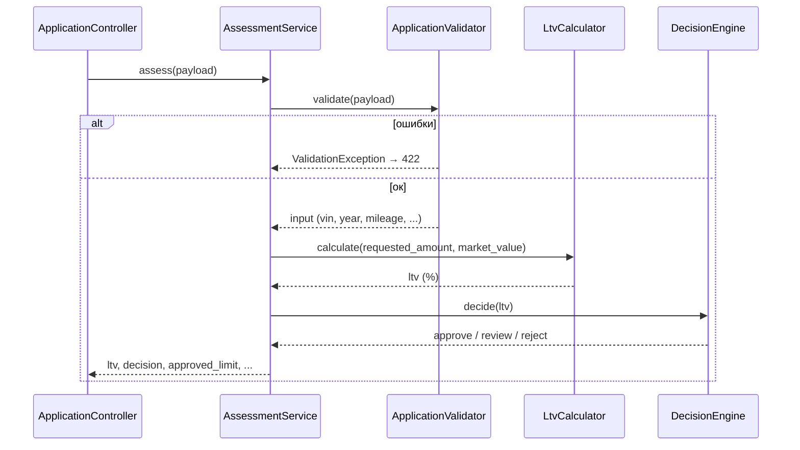

# Карта кода: как считается решение approve / review / reject

Артефакт анализа `backend/src/Domain/` и `backend/config/rules.php`.
Только описание текущего кода; исходники при анализе не менялись.

## Участники и порядок вызовов

Точка входа — `AppFactory::create()` (`backend/src/AppFactory.php`): загружает
`backend/config/rules.php` (строка 27) и собирает цепочку объектов (строки 30–39),
в том числе `new DecisionEngine($rules['ltv'])`. Дальше по запросу
`POST /api/applications` (или `POST /api/ltv`) вызывается
`ApplicationController::create()` / `ltv()` → `AssessmentService::assess($payload)`.

Внутри `AssessmentService::assess()` (`backend/src/Domain/AssessmentService.php`,
строки 30–41) шаги строго по порядку:

1. **`ApplicationValidator::validate($payload)`** — валидация и нормализация входа.
   Проверяет: VIN через `VinValidator::isValid()` (длина 17, `A-Z0-9`, без `I/O/Q` —
   из `rules['vin']`); год через `VehicleAge::inYears()` (не раньше
   `vehicle.min_year`, не в будущем, не старше `vehicle.max_age_years`); пробег
   (0…`vehicle.max_mileage_km`); `market_value` (> 0); сумму
   (`amount.min`…`amount.max`); срок (`term.min_months`…`term.max_months`).
   Любая ошибка → `ValidationException` → контроллер отвечает 422, расчёт
   прерывается. Успех → нормализованный массив
   `['vin','year','mileage','market_value','requested_amount','term_months']`.
2. **`LtvCalculator::calculate($input['requested_amount'], $input['market_value'])`** —
   проверяет, что оба значения > 0, возвращает `round(amount / value * 100, 2)` —
   LTV в процентах.
3. **`DecisionEngine::decide($ltv)`** — единственное место, где рождается решение.
   Пороги приходят из конструктора (`rules['ltv']`: `approve_max = 60.0`,
   `review_max = 85.0`):
   - `$ltv < 60.0` → `approve`;
   - `60.0 <= $ltv <= 85.0` → `review`;
   - `$ltv > 85.0` → `reject`.

   Нюанс: докблок говорит «`LTV <= approve_max -> approve`», но код проверяет
   строгое `<` (строка 32) — при LTV ровно 60.0 код вернёт `review`, а не
   `approve`. Это расхождение комментария с кодом, оно есть в текущем виде.
4. **Сборка результата**: `vehicle_age` (ещё раз через `VehicleAge::inYears()`),
   `ltv`, `decision`, `approved_limit` (= запрошенной сумме при `approve`,
   иначе 0). Лимит по `ltv_by_age` не считается — справочник объявлен в
   `rules.php` (строки 53–58), но в коде не используется (задача LOAN-12,
   о чём честно написано в докблоках `rules.php` и `AssessmentService`).

## Куда встанет правило «пробег > 400 000 км → review»

**Функция:** `DecisionEngine::decide()` — это единственный производитель
решения; альтернативное место — вызов этой функции в
`AssessmentService::assess()` (строка 33). Логика «пробег высокий → review» —
это правило решения, а не валидации, поэтому в `ApplicationValidator` оно
не принадлежит.

**Что для этого уже есть:**

- Нормализованный `int $input['mileage']` — возвращается
  `ApplicationValidator::validate()` и доступен в `assess()` ровно там,
  где вызывается `decide()`.
- Класс-владелец решения (`DecisionEngine`) и точка сборки в `AppFactory`
  (строка 37), куда можно пробросить новый порог.

**Чего не хватает:**

1. **Сигнатура `decide()`**: метод принимает только `float $ltv` — пробег
   в него не передаётся. Нужно вторым аргументом (или через контекст-объект).
2. **Порог 400 000 в `rules.php`**: такого ключа нет. Есть только
   `vehicle.max_mileage_km = 500000`, но это другая семантика — граница
   валидации (нарушение → 422), а не порог решения. По конвенции проекта
   число должно лечь в конфиг (например, новый ключ в секции `vehicle`).
3. **Инъекция порога в `DecisionEngine`**: конструктор сейчас получает только
   `$rules['ltv']` (`approve_max`, `review_max`) — секцию с новым порогом туда
   не передают.
4. **Приоритет правил не определён**: в коде нет ничего, что решает конфликт
   с LTV-исходом. Если LTV > 85 (`reject`) и пробег > 400 000 — «иначе решение
   review» понижает reject до review или правило должно ограничивать только
   approve? В текущем коде и ТЗ-формулировке ответа нет — это нужно определить
   при реализации.

## Что в коде уже сейчас проверяется про пробег

- **Только диапазон при валидации**: `ApplicationValidator::validate()`,
  строки 43–46 — `0 <= mileage <= 500000` (`vehicle.max_mileage_km`).
  Нарушение → `ValidationException` → HTTP 422 с ошибкой «Пробег от 0 до
  500000 км». На решение approve/review/reject пробег **не влияет никак**.
- **Пробег сохраняется**: нормализованное значение уходит в `$input`, попадает
  в БД (`vehicles.mileage_km` через `ApplicationRepository::save()`,
  строки 38–45) и доступно в карточке заявки (`show`).
- Более ничего: `LtvCalculator` пробег не принимает, `DecisionEngine` — тоже,
  отдельных правил/справочников по пробегу (аналога `ltv_by_age`) — **нет**.
