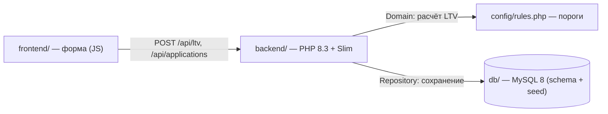

# Работа в worktree

## Рабочие папки

```text
$ git worktree list
/Users/savelyevdm/ai-test/carmoney-lab-savelev-tm                                                                0fb1ea6 [d1/1.2.1-1.2.3-savelev-tm]
/Users/savelyevdm/ai-test/carmoney-lab-savelev-tm/.kilo/worktrees/d1-1-2-3-worktree-savelev-tm-c57c85bd06091a0b  3bd434b [d1/1.2.3-worktree-savelev-tm]
```

## Ответ агента из второй сессии

## Компоненты сервиса (по README)

**carmoney-lab** — учебный сервис предварительной оценки заявки на заём под ПТС: принимает заявку (VIN, год, пробег, оценочная стоимость, сумма, срок), считает LTV (сумма / оценочная стоимость) и возвращает решение `approve` / `review` / `reject`.

Основные компоненты:

| Компонент | Роль |
|---|---|
| `backend/` | PHP 8.3 + Slim — API-сервис: `src/Domain` (бизнес-правила), `src/Http` (эндпоинты), `src/Repository` (доступ к БД), `config/rules.php` (пороги и лимиты), `public/` (точка входа) |
| `frontend/` | Форма заявки на ванильном JS, открывается на `http://localhost:8080/` |
| `db/` | MySQL 8: `schema.sql` (схема) и `seed.sql` (синтетические заявки), применяется при первом старте тома |
| `tests/` | PHPUnit: `Unit/` и `Feature/` |
| Инфраструктура | `docker-compose.yml` (сервисы `backend` + `db`), `Makefile` (`make up/test/lint/down/seed`) |
| Агентские артефакты | `AGENTS.md`, `kilo.jsonc`, `.kilo/agents/`, `docs/`, `.githooks/`, `scripts/`, `mocks/` |

## Как они взаимодействуют



1. **Пользователь → фронтенд**: заполняет форму заявки на странице `http://localhost:8080/`.
2. **Фронтенд → бэкенд**: форма отправляет данные в API: `POST /api/ltv` (только расчёт, без сохранения) или `POST /api/applications` (сохранить заявку и вернуть решение). Есть также `GET /health`, `GET /api/applications` (список, `?status=decided`) и `GET /api/applications/{id}`.
3. **Внутри бэкенда**: слой `Http` принимает запрос, `Domain` считает LTV и применяет правила из `config/rules.php` (пороги не хардкодятся), `Repository` пишет заявки в MySQL.
4. **Инфраструктура**: `make up` поднимает два контейнера — `backend` (PHP, порт 8080) и `db` (MySQL 8); бэкенд стартует только после healthcheck базы, база при первом старте инициализируется из `db/schema.sql` и `db/seed.sql`. `make test` гоняет PHPUnit, `make lint` проверяет синтаксис PHP.

## Текущая рабочая папка и ветка

- **Папка** (`pwd`): `/Users/savelyevdm/ai-test/carmoney-lab-savelev-tm/.kilo/worktrees/d1-1-2-3-worktree-savelev-tm-c57c85bd06091a0b`
- **Ветка** (`git rev-parse --abbrev-ref HEAD`): `d1/1.2.3-worktree-savelev-tm`